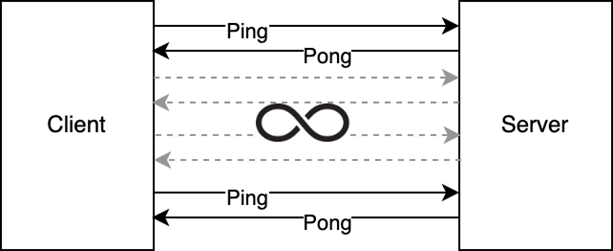

**WebTransport Ping-Pong App**

***Create a client-server ping-pong application with the following specs:***

 Essential Requirements:
- Preferably the Client should be written in RUST, but feel free to use any other language you are comfortable with or believe is best for this operation.
- The Server should be written in Python
- Communication protocol should be in WebTransport
- Provide some unit test coverage for both sides to demonstrate your skill in unit testing

Desirable Requirements:
- Make the communication channel secure or suggest what security measures you would implement given more time.  `Done!`
- Provide a plan for Kubernetes deployment  `This is Devops area, and require server to check!`
- Provide a plan/design for an auto-recovery mechanism for both sides (in case of a temporary connection failure). Feel free to implement that if you have enough time.
- Provide integration tests  `Beta version`
- Can you think of a way for the client to auto-discover the server without the need to point it to the exact server endpoint?  `Done! Read remarks!`

---

Install OpenSSL on Windows
```
choco install openssl
```


To create a self-signed server certificate, you can use the openssl command line tool. Here's an example command that generates a new private key and server certificate in the PEM format:

```
openssl req -newkey rsa:2048 -nodes -keyout server.key -x509 -days 365 -out server.crt
```

This command generates a 2048-bit RSA key and a self-signed server certificate that's valid for 365 days. The private key is saved to server.key and the certificate is saved to server.crt.

*Remarks!*
- To run tests (test.py and integration_test.py), run server before!
- Dockerfile containe server part
- Code developed and tested local on MS Windows!

Desirable Requirements:
- Can you think of a way for the client to auto-discover the server without the need to point it to the exact server endpoint?
`Yes. You can discover any data use zeroconfig for example library or any other UDP solution to get/set server data, but UDP work only in one-ranked networks. You dont provide any data about you network, so solution not implemented.`
